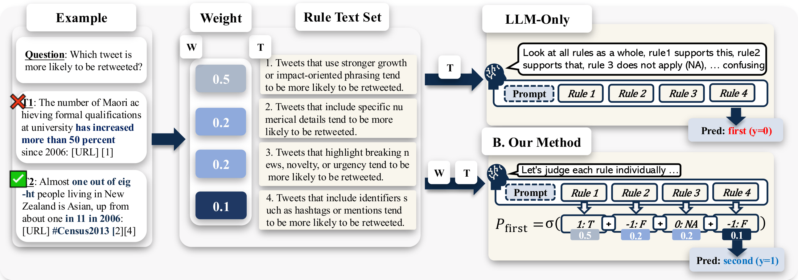
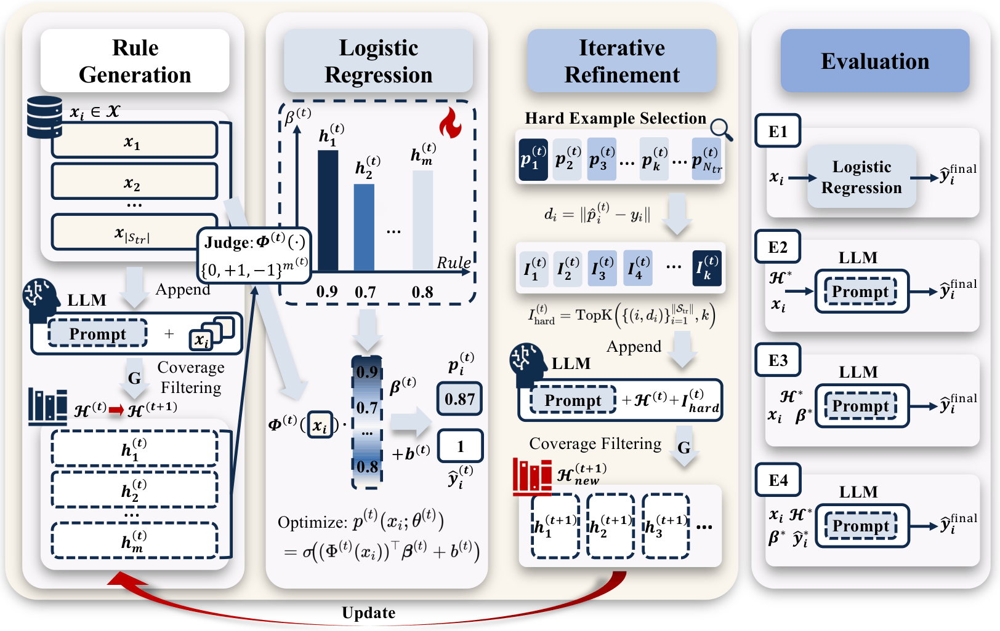

# RLIE: Rule Learning via Iterative Estimation



<p align="center">
  
  
  <a href="https://arxiv.org/abs/2510.19698"></a>
  
</p>

RLIE is an interpretable rule-learning pipeline for text classification. It asks an LLM to propose natural-language rules, scores each rule on examples, fits a sparse logistic model over rule activations, and iteratively refines the rule set using hard examples.

Paper: [RLIE: Rule Generation with Logistic Regression, Iterative Refinement, and Evaluation for Large Language Models](https://arxiv.org/abs/2510.19698)

This release contains the RLIE algorithm, task prompts, and bundled datasets. It intentionally excludes internal analysis scripts, cached LLM outputs, and experiment result folders.

## Highlights

- Natural-language rules remain inspectable throughout training.
- Sparse logistic regression assigns weights to rules and selects useful rules.
- Hard-example mining drives iterative rule refinement.
- OpenAI-compatible remote APIs and Ollama-style local models are supported.
- Saved rule snapshots make evaluation reruns possible without regenerating rules.

## Method



RLIE runs the following loop:

1. Sample training examples and ask an LLM to generate candidate rules.
2. Score each rule on train and validation examples with an LLM judge.
3. Convert rule decisions into binary rule-feature matrices.
4. Fit an elastic-net logistic regression model over rule features.
5. Select hard or misclassified examples from prediction probabilities.
6. Ask the LLM to refine or add rules using those hard examples.
7. Stop when validation performance stops improving or the round budget is reached.

The final artifact is a sparse weighted rule set, test metrics, and saved feature matrices.

## Quick Start

```bash
git clone https://github.com/YangYang-624/RLIE.git
cd RLIE

python -m venv .venv
source .venv/bin/activate
pip install -e .

export RLIE_BASE_URL="https://api.deepseek.com"
export RLIE_API_KEY="your_api_key_here"

python -m rlie.main --config configs/default.yaml
```

Run RLIE from a source checkout. Keep `configs/`, `data/`, and `rlie/`
together, and run commands from the repository root.

The default config runs `real/headline_binary` with `regression_only` evaluation.
For multi-key runs, export `RLIE_API_KEY_1`, `RLIE_API_KEY_2`, ... and use the
list form shown in the configuration section below.
After installation, the same command is also available as:

```bash
rlie-train --config configs/default.yaml
```

## Project Layout

```text
RLIE/
├── assets/figs/               # README figures and original PDF sources
├── configs/                   # Release configs
├── data/                      # Raw dataset JSON files and dataset documentation
├── rlie/
│   ├── main.py                # Training entry point
│   ├── run_eval_only.py       # Re-evaluate saved rule snapshots
│   ├── core/                  # Task loop, rule features, modeling, metrics, convergence
│   ├── datasets/
│   │   ├── data_loader.py     # Dataset loading
│   │   ├── tasks.py           # Task wrappers
│   │   ├── labels.py          # Label parsing
│   ├── task_specs/            # Task definitions and prompt resources
│   ├── llm/                   # Prompting, rule generation, rule scoring, parsing, API clients
│   └── utils/                 # Logging, concurrency, shared evaluation utilities
├── pyproject.toml             # Local installation metadata and CLI commands
├── requirements.txt
├── .env.example               # Example environment variables
└── README.md
```

Most users only need `configs/default.yaml` plus the training and evaluation entry points under `rlie/`.

This release is source-first rather than a standalone wheel-style package. The
runtime contract assumes the checked-out repository layout shown above.

The main code path is:

```text
python -m rlie.main
          -> rlie/core/task_runner.py      # training rounds and reporting
          -> rlie/llm/rule_generator.py    # rule generation
          -> rlie/llm/rule_scorer.py       # rule scoring
          -> rlie/llm/ruleset_eval.py      # batched scoring / LLM evaluation
          -> rlie/llm/parsing.py           # response parsing
          -> rlie/core/feature_manager.py  # rule-feature matrix
          -> rlie/core/modeling.py         # sparse logistic model
```

Supporting modules:

| Module | Role |
| --- | --- |
| `rlie/datasets/data_loader.py`, `rlie/datasets/tasks.py`, `rlie/datasets/labels.py` | Load task configs, dataset splits, and labels. |
| `rlie/task_specs/<task>/task.yaml`, `rlie/task_specs/<task>/prompts.yaml` | Define task metadata, data paths, and prompt templates. |
| `rlie/core/task_runner.py` | Run the iterative RLIE training loop for one task/repeat. |
| `rlie/llm/rule_generator.py` | Generate candidate rules from the configured LLM backend. |
| `rlie/llm/rule_scorer.py` | Score candidate rules on dataset samples with the configured LLM backend. |
| `rlie/llm/prompt.py`, `rlie/llm/parsing.py`, `rlie/llm/ruleset_eval.py` | Build prompts, parse model responses, and execute batched LLM evaluation. |
| `rlie/utils/eval_utils.py`, `rlie/run_eval_only.py` | Re-evaluate saved rule snapshots. |
| `rlie/core/metrics.py`, `rlie/core/convergence.py` | Metrics and stopping logic. |
| `rlie/llm/api_client_pool.py`, `rlie/utils/concurrent_config.py` | API concurrency utilities. |

## Configuration

The release config does not contain API keys. Credentials are read from environment variables:

```yaml
llms:
  generation:
    rule_learning_model: deepseek-chat
    evaluation_models:
      - deepseek-chat
  client:
    base_url: ${RLIE_BASE_URL}
    api_key: ${RLIE_API_KEY}
```

The default release config is written for a DeepSeek-compatible endpoint:

```bash
export RLIE_BASE_URL="https://api.deepseek.com"
export RLIE_API_KEY="your_api_key_here"
```

`llms.client.api_key` supports both of these forms:

- a single string: one API key
- a YAML list: multiple API keys

RLIE uses the same client configuration for both rule generation and rule
scoring. If you provide multiple keys, RLIE will rotate them through the client
pool and scale evaluation concurrency from `llms.evaluation.max_concurrent_per_key`.

Multiple keys are supported for higher-throughput runs:

```yaml
llms:
  client:
    base_url: ${RLIE_BASE_URL}
    api_key:
      - ${RLIE_API_KEY_1}
      - ${RLIE_API_KEY_2}
```

Environment variable example:

```bash
export RLIE_BASE_URL="https://api.deepseek.com"
export RLIE_API_KEY_1="your_first_api_key"
export RLIE_API_KEY_2="your_second_api_key"
```

Useful fields:

| Field | Meaning |
| --- | --- |
| `data_roots` | Task identifiers such as `real/headline_binary`. Task definitions live under `rlie/task_specs/`; raw examples live under `data/`. |
| `generation.sample_size` | Examples shown in each rule generation/refinement call. |
| `generation.rules_per_call` | Number of rules requested per LLM call. |
| `max_rules` | Maximum number of retained rules after pruning. |
| `rule_coverage_threshold` | Minimum training coverage required for a rule. |
| `model_selection_metric` | CV metric for fitting the logistic model. |
| `best_model_metric` | Validation metric used to choose the final round. |
| `repeat` | Number of repeated runs with different seeds. |
| `llms.evaluation.max_concurrent_per_key` | Per-key concurrency for rule scoring. With multiple API keys, RLIE scales the total evaluation budget from this value. |

## Tasks

This release currently supports exactly six tasks:

- `real/headline_binary`
- `real/deceptive_reviews`
- `real/dreaddit`
- `real/llamagc_detect`
- `real/persuasive_pairs`
- `real/retweet`

Tasks are selected through `data_roots`:

```yaml
data_roots:
  - real/headline_binary
  - real/deceptive_reviews
  - real/dreaddit
```

Each task identifier maps to a task definition under `rlie/task_specs/` plus raw JSON data under `data/`. Each task definition is split into `task.yaml`, `prompts.yaml`, and `metadata.json`.

If you want to switch tasks, replace the `data_roots` entries with any subset of the six supported identifiers above.

## Smoke Test

To verify the full pipeline with a low-cost run, reduce the sample sizes and
round budget in a temporary config:

```yaml
num_train_samples: 50
num_valid_samples: 50
num_test_samples: 50
repeat: 1
convergence:
  max_rounds: 2
  patience: 1
```

Then run:

```bash
python -m rlie.main --config <your_smoke_config.yaml>
```

## Evaluation

`evaluation.modes` accepts a comma-separated string or YAML list.

| Mode | Description |
| --- | --- |
| `regression_only` | Use the sparse logistic model over rule activations. |
| `llm_evaluation` | Ask the LLM to predict using learned rules. |
| `llm_evaluation_with_linear_regression` | Give the LLM weighted rules and model bias. |
| `llm_evaluation_with_linear_regression_and_label` | Also give the LLM the logistic model prediction. |

`regression_only` is the cheapest and most reproducible mode. The LLM evaluation modes require additional test-time API calls.

## Outputs

Runs are written under:

```text
outputs/run_YYYYMMDD_HHMMSS/<run_name_optional>_<task>[_repeatN]/
```

With the default release config and `repeat: 1`, the run directory usually looks
like:

```text
outputs/run_YYYYMMDD_HHMMSS/real_headline_binary/
```

Important files:

| File | Description |
| --- | --- |
| `final_round_metrics.json` | Best round, validation metrics, and selected hyperparameters. |
| `final_test_metrics_*.json` | Test metrics by evaluation mode/model. |
| `round_*_metrics.json` | Per-round training and validation metrics. |
| `round_*_train_dataset.csv` | Rule-feature training matrix. |
| `round_*_val_dataset.csv` | Rule-feature validation matrix. |
| `rule_snapshots/round_*_rules.json` | Rule text, weights, and rule-level metrics. |
| `rule_snapshots/round_*_rules.csv` | CSV version of the saved rule snapshot. |

## Re-evaluate Saved Rules

If only evaluation settings changed, reuse saved snapshots:

```bash
python -m rlie.run_eval_only \
  --config configs/default.yaml \
  --run_dir outputs/run_YYYYMMDD_HHMMSS/real_headline_binary_repeat1
```

After installation, this is also available as:

```bash
rlie-eval --config configs/default.yaml --run_dir <run_dir>
```

To evaluate a specific round:

```bash
python -m rlie.run_eval_only --config configs/default.yaml --run_dir <run_dir> --round 3
```

## License

The RLIE code in this release is licensed under the MIT License. See `LICENSE`.

Bundled datasets follow their own licenses and redistribution terms. See `data/README.md` and `data/THIRD_PARTY.md` for dataset-specific details.

## Citation

If you use RLIE in your work, please cite the accompanying paper:

```bibtex
@misc{yang2025rlie,
  title={RLIE: Rule Generation with Logistic Regression, Iterative Refinement, and Evaluation for Large Language Models},
  author={Yang, Yang and Xu, Hua and Hu, Zhangyi and Yue, Yutao},
  year={2025},
  eprint={2510.19698},
  archivePrefix={arXiv},
  primaryClass={cs.AI},
  url={https://arxiv.org/abs/2510.19698}
}
```

## Notes

- Do not commit API keys. Keep them in environment variables or a local `.env` file ignored by Git.
- Runtime outputs can be large and are ignored by `.gitignore`.
- Commands in this README assume you are running from the `RLIE/` repository root.
